# SmartFIR – Digital FIR Complaint Management System

## 🚨 Overview

SmartFIR is a proposed digital platform designed to simplify and modernize the process of complaint registration, FIR management, emergency detection, evidence handling, and communication between citizens and police authorities.

The system aims to make the complaint process more accessible, transparent, secure, and efficient through AI-assisted processing, voice input, multilingual support, OCR, and centralized case management.

---

## 🎯 Problem Statement

The traditional complaint and FIR registration process can involve challenges such as:

* Lengthy and manual complaint registration
* Language barriers between citizens and authorities
* Difficulty tracking complaint status
* Delays in identifying emergency situations
* Manual handling of documents and evidence
* Lack of centralized complaint and investigation management
* Difficulty processing information from uploaded documents

SmartFIR aims to address these challenges through a unified digital platform.

---

## 💡 Proposed Solution

SmartFIR provides dedicated interfaces for citizens, police officers, emergency personnel, and station heads.

Citizens can submit complaints using text or voice, while AI-assisted processing helps classify complaints and identify emergency situations.

Police authorities can manage complaints, FIRs, investigations, evidence, officers, and case status through centralized dashboards.

---

## ⭐ Key Features

### 👤 Citizen Module

* User Registration and Login
* Digital Complaint Registration
* Voice-Based Complaint Submission
* Speech-to-Text Conversion
* Multilingual Complaint Support
* Complaint ID Generation
* Complaint Status Tracking
* Notifications
* Emergency Reporting

### 🤖 AI-Assisted Processing

* Complaint Classification
* Emergency Detection
* Language Processing
* Speech-to-Text Processing
* AI-Assisted Complaint Analysis
* AI Police Assistant

### 📄 Document & OCR Processing

* PDF Document Upload
* OCR-Based Text Extraction
* Document Content Processing
* Automatic Extraction of Relevant Information
* Digital Evidence/Document Analysis

### 👮 Police Module

* Police Dashboard
* New Complaint Management
* FIR Management
* Investigation Management
* Evidence Management
* Officer Management
* Emergency Alerts
* Case Status Updates
* Audit Activity Tracking

### 🏢 Station Head Module

* Station Head Dashboard
* Officer Management
* Complaint Monitoring
* FIR Monitoring
* Investigation Monitoring
* Case Overview
* Station-Level Activity Monitoring

### 🚨 Emergency Management

* Emergency Detection
* Emergency Alerts
* Emergency Center Dashboard
* Priority-Based Complaint Handling

---

## 🔄 System Workflow

```text
Citizen
   ↓
Login / Registration
   ↓
Complaint Submission
   ↓
Text / Voice Input
   ↓
Speech-to-Text
   ↓
Language Processing
   ↓
Complaint Classification
   ↓
Emergency Detection
   ↓
Complaint ID Generation
   ↓
Police Station
   ↓
Complaint Verification
   ↓
FIR Registration
   ↓
Officer Assignment
   ↓
Investigation
   ↓
Evidence Management
   ↓
Status Updates
   ↓
Case Resolution
```

---

## 🏗️ System Architecture

```text
┌──────────────────────────────┐
│           Users              │
│  Citizen | Police | Admin    │
└──────────────┬───────────────┘
               ↓
┌──────────────────────────────┐
│       Application Layer      │
│ Dashboards | Complaint UI    │
└──────────────┬───────────────┘
               ↓
┌──────────────────────────────┐
│        AI Processing         │
│ NLP | Classification | OCR   │
│ Speech-to-Text | Detection   │
└──────────────┬───────────────┘
               ↓
┌──────────────────────────────┐
│       Backend Services       │
│ APIs | Authentication        │
│ Complaint & FIR Management   │
└──────────────┬───────────────┘
               ↓
┌──────────────────────────────┐
│           Database           │
│ Users | Complaints | FIRs    │
│ Evidence | Officers | Logs   │
└──────────────────────────────┘
```

---

## 🖥️ UI/UX Prototype

The current repository contains the UI/UX prototype and interface designs developed for SmartFIR.

### Citizen Screens

* Home Screen
* Sign In
* Citizen Dashboard
* File a Complaint
* Track Complaint
* Notifications
* Emergency Alert

### Police Screens

* Police Dashboard
* New Complaint
* FIR Management
* Investigation
* Evidence Management
* Officer Management
* Audit Activity

### Station Head Screens

* Station Head Dashboard

---

## 📸 Screenshots

### Citizen Dashboard

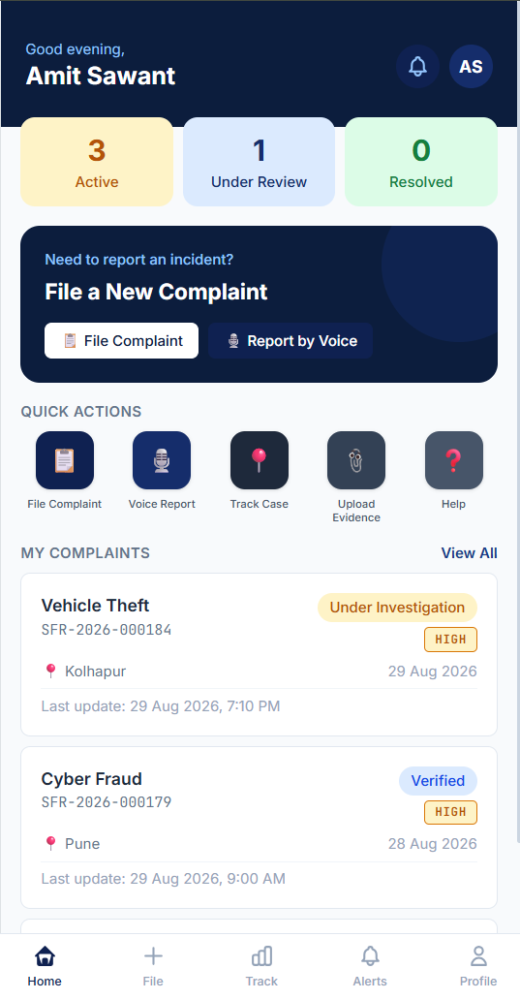

### File a Complaint

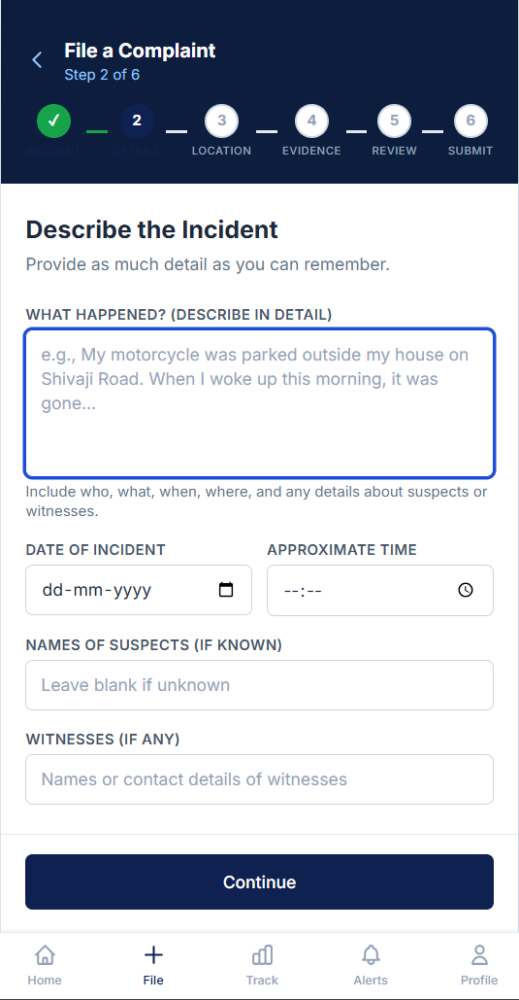

### Track Complaint

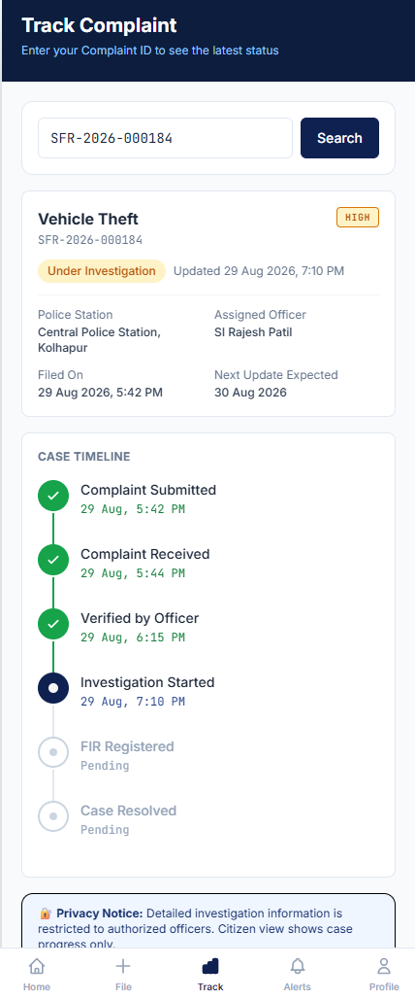

### Notifications


### Police Dashboard

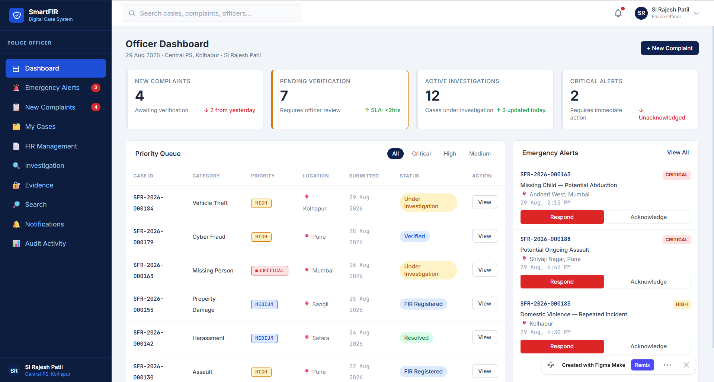

### Emergency Alert

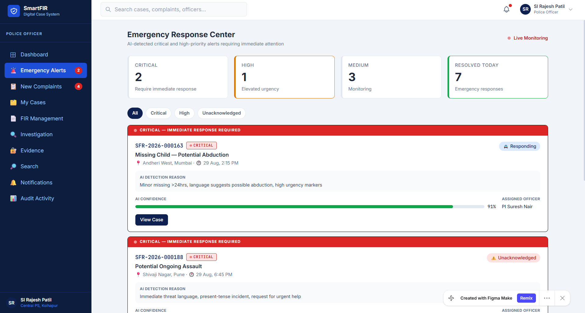

### New Complaint

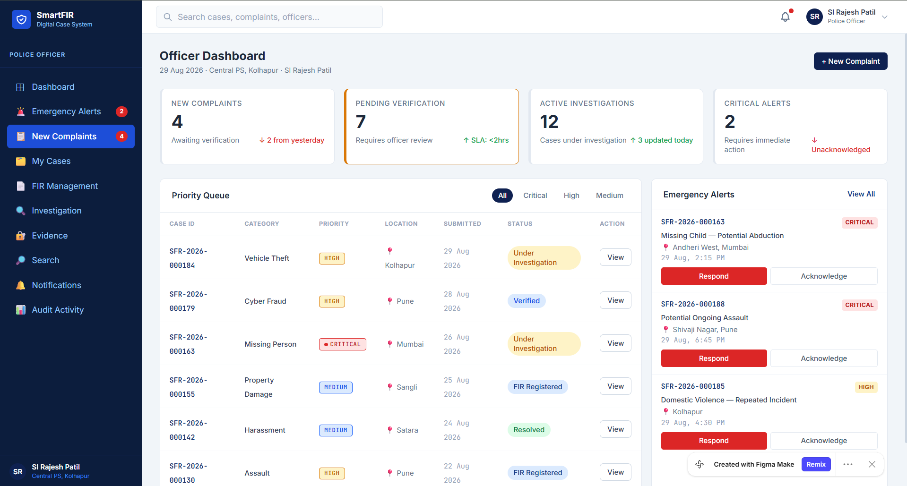

### FIR Management

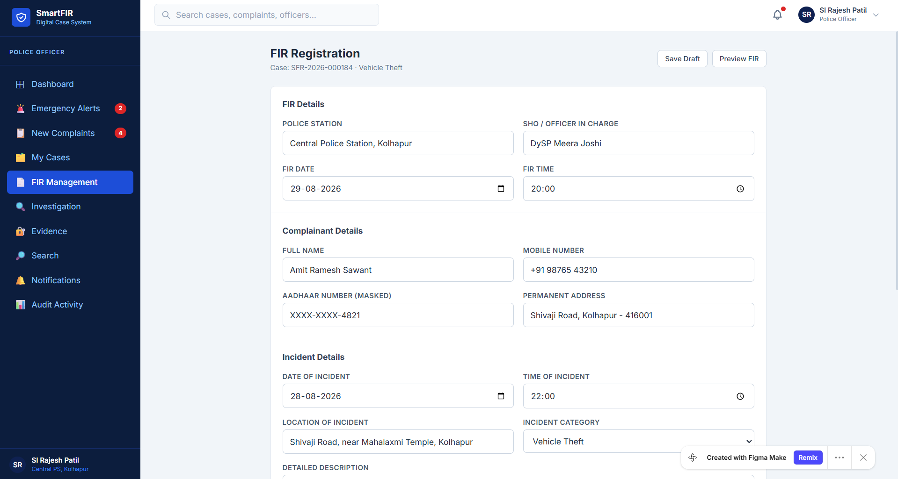

### Investigation

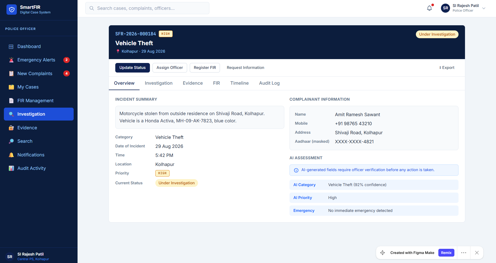

### Evidence Management

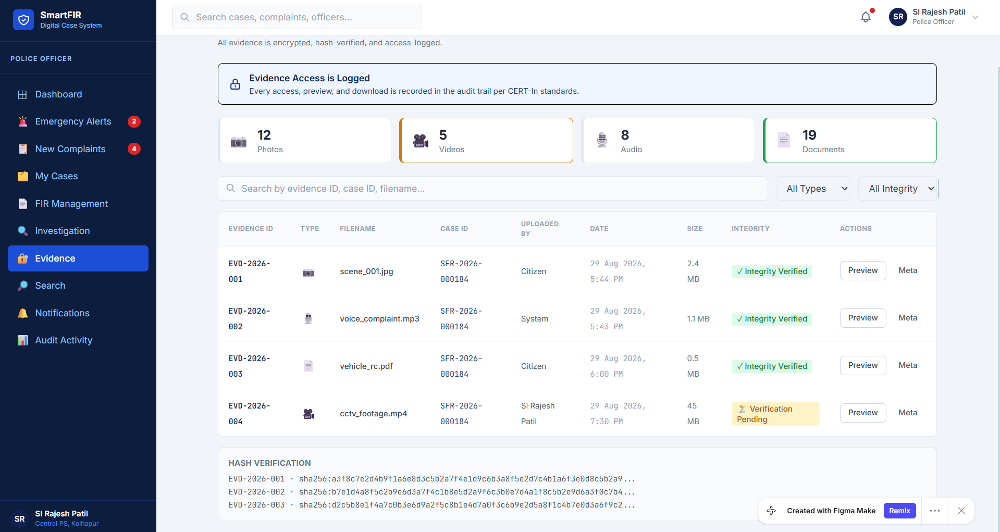

### Audit Activity

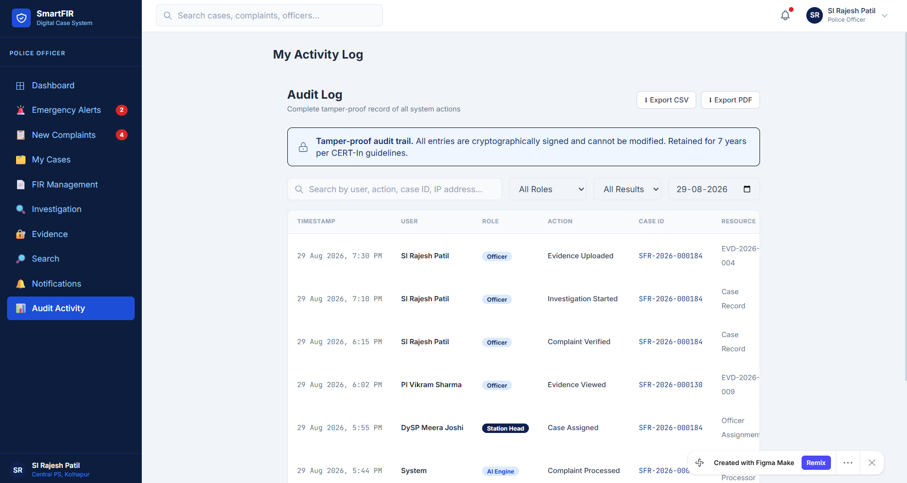

### Officer Management

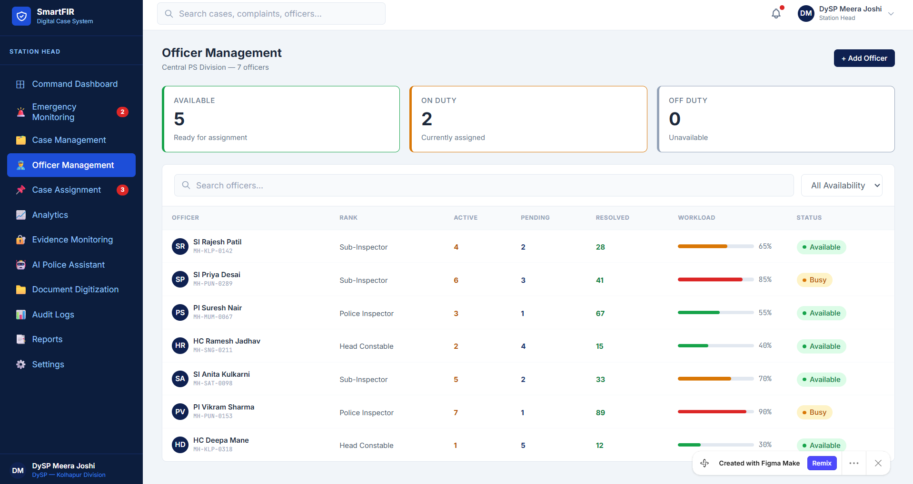

### Station Head Dashboard

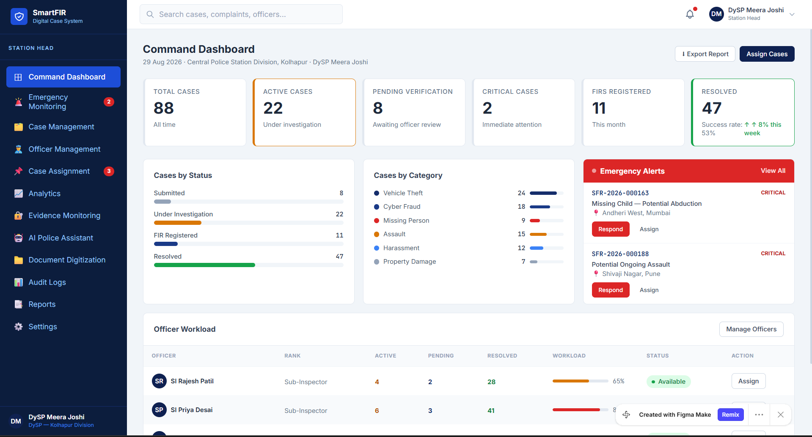

### Home Screen

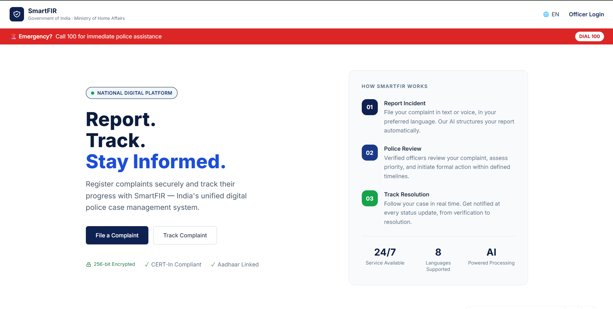

### Sign In

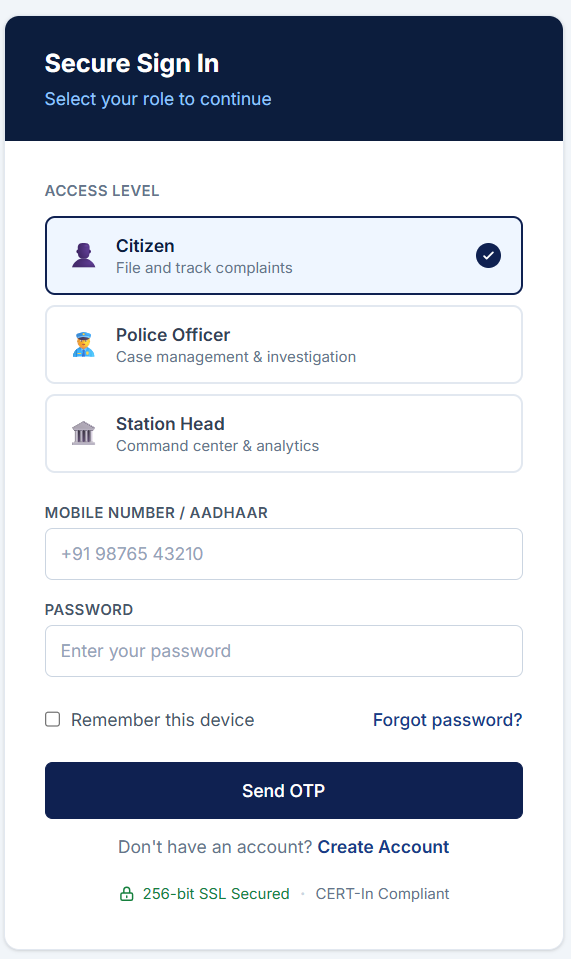

---

## 🛠️ Proposed Technology Stack

### Frontend

* Android / Web Application
* Responsive UI

### Backend

* REST APIs
* Authentication and Authorization
* Complaint and FIR Management Services

### Database

* MySQL / PostgreSQL

### AI & Processing

* Natural Language Processing
* Speech-to-Text
* OCR
* Complaint Classification
* Emergency Detection

### Security

* Role-Based Access Control
* Secure Authentication
* Encrypted Data Storage
* Audit Logs
* Secure Evidence Management

---

## 🔐 Security Considerations

SmartFIR is designed with security and privacy as important components.

The proposed system includes:

* Role-Based Access
* Secure Authentication
* Controlled Evidence Access
* Audit Activity Logging
* Secure Document Handling
* Data Encryption
* Police and Station-Level Access Control

---

## 🚧 Current Project Status

**Current Phase: UI/UX Prototype**

The current repository contains:

* UI/UX Designs
* Figma Prototype
* System Architecture
* Project Documentation
* Interface Screenshots

The complete backend, database, AI services, and production deployment will be developed in subsequent phases.

---

## 🚀 Future Development

1. Frontend Implementation
2. Backend API Development
3. Database Integration
4. Authentication and Authorization
5. Speech-to-Text Integration
6. OCR Implementation
7. AI Complaint Classification
8. Emergency Detection
9. Evidence Storage and Management
10. Police Workflow Integration
11. Testing and Security Validation
12. Deployment

---

## 🎨 Design

The UI/UX prototype was designed using Figma.

The prototype link is available in:

```text
design/figma-prototype.txt
```

---

## 📚 Documentation

Project documentation is available in the `docs/` directory.

* Problem Statement
* Solution Overview
* System Architecture

---

## 👥 Team

**SmartFIR Development Team**

---

## 📌 Project Status

> 🚧 SmartFIR is currently in the prototype and design phase.
> The repository will be continuously updated as the system moves toward implementation.
